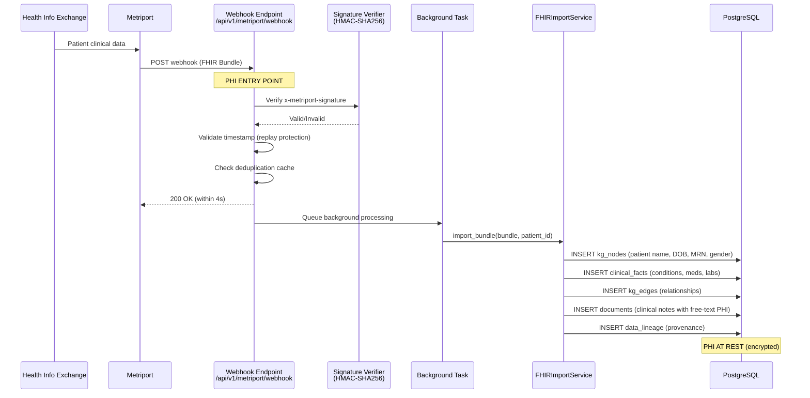
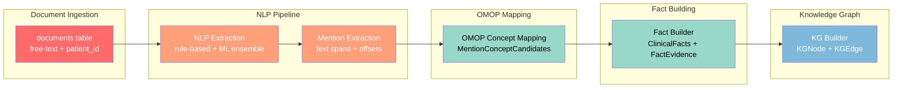
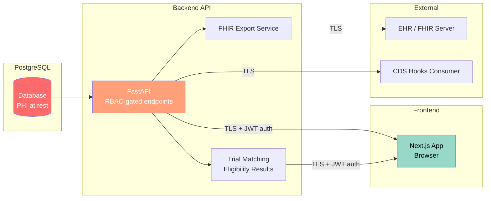
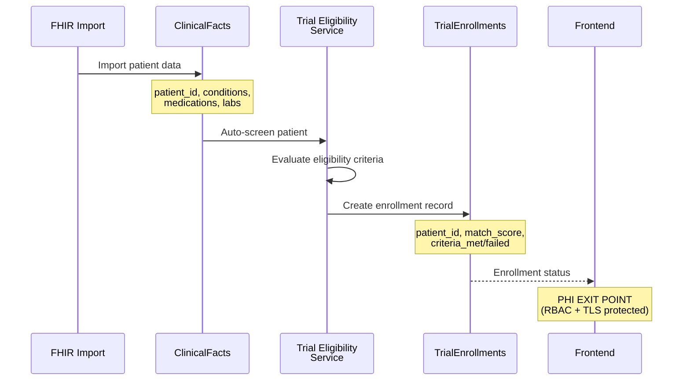

# PHI Data Flow Mapping (CISO-7)

**Document ID:** CISO-7-PHI-DFM
**Version:** 1.0
**Last Updated:** 2026-02-08
**Classification:** CONFIDENTIAL - Internal Use Only
**Owner:** CISO / Privacy Officer

## 1. Purpose

This document provides a comprehensive mapping of Protected Health Information (PHI) as it flows through the Clinical Ontology Normalizer platform. It identifies all PHI data elements per the HIPAA Privacy Rule's 18 identifiers, documents where PHI is stored, how it is protected, and who has access. This mapping supports HIPAA compliance, risk assessments, and breach notification requirements.

---

## 2. PHI Data Inventory

The following table catalogs all PHI elements handled by the system, mapped to the 18 HIPAA identifiers (45 CFR 164.514(b)(2)).

| # | HIPAA Identifier | Fields in System | Storage Location(s) | Encrypted at Rest | Encrypted in Transit | Access Control |
|---|---|---|---|---|---|---|
| 1 | Names | `kg_nodes.properties.fhir_id` (patient label), `kg_nodes.label` (patient name), FHIR Patient.name, `users.name`, `users.email` | PostgreSQL: `kg_nodes`, `users`; FHIR Bundle payloads in `structured_resources.payload` | Yes (PG TDE / volume encryption) | Yes (TLS 1.2+) | RBAC: `patients:read` permission required |
| 2 | Geographic data (address, city, state, ZIP) | FHIR Patient.address (within Bundle payloads), `structured_resources.payload` | PostgreSQL: `structured_resources` JSONB | Yes | Yes | RBAC: `patients:read` |
| 3 | Dates (DOB, admission, discharge, death) | `kg_nodes.properties.birth_date`, FHIR Patient.birthDate, `clinical_facts.start_date`/`end_date`, `trial_enrollments.screening_date`/`enrollment_date`, `kg_edges.event_date`/`valid_from`/`valid_to` | PostgreSQL: multiple tables | Yes | Yes | RBAC: `patients:read`, `documents:read` |
| 4 | Phone numbers | FHIR Patient.telecom (within Bundle payloads), `structured_resources.payload` | PostgreSQL: `structured_resources` JSONB | Yes | Yes | RBAC: `patients:read` |
| 5 | Fax numbers | FHIR Patient.telecom (within Bundle payloads) | PostgreSQL: `structured_resources` JSONB | Yes | Yes | RBAC: `patients:read` |
| 6 | Email addresses | FHIR Patient.telecom, `users.email` | PostgreSQL: `structured_resources`, `users` | Yes | Yes | RBAC: `patients:read`, `admin:manage_users` |
| 7 | Social Security Numbers | May appear in FHIR Patient.identifier, clinical note free text (`documents.text`) | PostgreSQL: `structured_resources`, `documents` | Yes | Yes | RBAC: `patients:read`; redacted in logs |
| 8 | Medical Record Numbers (MRN) | `kg_nodes.properties.mrn`, FHIR Patient.identifier, `documents.patient_id` (if MRN-based) | PostgreSQL: `kg_nodes`, `structured_resources`, `documents` | Yes | Yes | RBAC: `patients:read` |
| 9 | Health plan beneficiary numbers | FHIR Coverage.identifier (within Bundle payloads) | PostgreSQL: `structured_resources` JSONB | Yes | Yes | RBAC: `patients:read` |
| 10 | Account numbers | FHIR Account resources, patient billing identifiers | PostgreSQL: `structured_resources` JSONB | Yes | Yes | RBAC: `billing:read`; redacted in logs |
| 11 | Certificate/license numbers | FHIR Practitioner.identifier, provider licenses | PostgreSQL: `structured_resources` JSONB | Yes | Yes | RBAC: `patients:read` |
| 12 | Vehicle identifiers | Not expected in clinical data; may appear in free-text notes | PostgreSQL: `documents.text` | Yes | Yes | RBAC: `documents:read` |
| 13 | Device identifiers/serial numbers | FHIR Device.identifier, implant serial numbers | PostgreSQL: `structured_resources` JSONB | Yes | Yes | RBAC: `patients:read` |
| 14 | Web URLs | FHIR resource fullUrl, attachment URLs (S3 pre-signed) | PostgreSQL: `structured_resources` JSONB; transient in webhook processing | Yes | Yes | RBAC: `patients:read` |
| 15 | IP addresses | `audit_logs.ip_address`, `refresh_tokens.ip_address` | PostgreSQL: `audit_logs`, `refresh_tokens` | Yes | Yes | RBAC: `admin:read` (audit), system-only |
| 16 | Biometric identifiers | Not collected by this system | N/A | N/A | N/A | N/A |
| 17 | Full-face photographs | Not collected by this system | N/A | N/A | N/A | N/A |
| 18 | Any other unique identifying number | `documents.patient_id`, `clinical_facts.patient_id`, `kg_nodes.patient_id`, `trial_enrollments.patient_id`, FHIR resource IDs | PostgreSQL: all patient-linked tables | Yes | Yes | RBAC: `patients:read` |

---

## 3. Data Flow Diagrams

### 3.1 Inbound: Metriport Webhook to Database



**PHI elements in this flow:**
- Patient demographics (name, DOB, gender, MRN, address, phone, email)
- Clinical notes (free-text containing embedded PHI)
- Conditions, medications, allergies, procedures, observations
- Dates of service (encounter periods, onset dates)
- FHIR resource identifiers
- Provider information (within encounters/reports)

### 3.2 Processing: NLP Extraction through Knowledge Graph



**PHI flow notes:**
- `documents.text`: Contains full clinical note text with embedded PHI (names, dates, SSNs, MRNs in free text)
- `mentions.text`: Extracted text spans that may contain PHI
- `clinical_facts`: Linked to `patient_id` -- the patient_id itself is PHI (identifier #18)
- `kg_nodes`/`kg_edges`: Patient-linked graph data; patient nodes store name, DOB, MRN in properties
- All intermediate data is linked via `patient_id` (a unique identifying number)

### 3.3 Outbound: API Responses and Exports



**PHI exit points:**
1. **API responses to Frontend**: Patient demographics, clinical facts, KG data, trial matching results. Protected by JWT authentication, RBAC permissions, TLS encryption.
2. **FHIR Export**: Full FHIR Bundle reconstruction with all patient data. Protected by TLS, authentication tokens.
3. **Trial Matching Results**: Patient eligibility scores, criteria met/failed. Contains `patient_id` and clinical data references. Protected by RBAC (`patients:read` + trial access).
4. **CDS Hooks**: Clinical decision support cards containing patient-specific recommendations. Protected by TLS and SMART on FHIR authorization.
5. **Audit Log Exports**: May contain `patient_id`, `user_id`, access timestamps. Protected by `admin:read` permission.

### 3.4 Trial Recruitment PHI Flow



---

## 4. Access Control Matrix

Access to PHI is governed by the RBAC system defined in `backend/app/models/rbac.py`. The following matrix maps roles to PHI access levels.

| PHI Category | Admin | Provider | Biller | Viewer | System/API |
|---|---|---|---|---|---|
| Patient demographics (name, DOB, gender) | Full | Full | Name only | None | As configured |
| Patient identifiers (MRN, SSN) | Full | Full | MRN only | None | As configured |
| Contact info (address, phone, email) | Full | Full | None | None | As configured |
| Clinical notes (free text) | Full | Full | None | None | NLP pipeline |
| Conditions/diagnoses | Full | Full | Read (for coding) | Read (de-identified) | Full |
| Medications | Full | Full | Read (for coding) | Read (de-identified) | Full |
| Lab results/observations | Full | Full | None | Read (de-identified) | Full |
| Procedures | Full | Full | Read (for coding) | Read (de-identified) | Full |
| Trial enrollment data | Full | Full | None | None | Eligibility engine |
| Audit logs | Full | Own access only | Own access only | None | Write-only |
| Provider information | Full | Full | Read | None | As configured |
| IP addresses (audit) | Full | None | None | None | System-only |

**Permission mappings (from RBAC model):**
- `patients:read` -- View patient demographics and clinical data
- `patients:write` -- Create/modify patient records
- `documents:read` -- View clinical documents (contains free-text PHI)
- `documents:write` -- Create/modify documents
- `billing:read` -- View billing-related data (limited PHI)
- `admin:manage_users` -- User administration
- `admin:read` -- View audit logs and system configuration

---

## 5. Data Retention Policies

| PHI Category | Retention Period | Justification | Disposal Method |
|---|---|---|---|
| Clinical documents (notes) | 7 years from last encounter | HIPAA: 6 years minimum; state laws may require longer | Soft delete (SoftDeleteMixin) -> hard purge after retention |
| Patient demographics | 7 years from last encounter | HIPAA retention requirement | Soft delete -> hard purge |
| Clinical facts / KG data | 7 years from creation | Derived data; retained for provenance | Cascade delete with source |
| Audit logs | 7 years from creation | HIPAA: 6 years; 21 CFR Part 11 compliance | Immutable; archived to cold storage |
| Trial enrollment records | 15 years from study completion | FDA 21 CFR 11.10; ICH E6(R2) GCP | Soft delete -> archive |
| FHIR Bundle payloads | 7 years from import | Source data retention | Soft delete -> hard purge |
| Structured resources | 7 years from import | Source data retention | Soft delete -> hard purge |
| Session/auth data (tokens) | 90 days from expiry | No clinical PHI; security artifact | Hard delete |
| Provenance records | 7 years from creation | Audit trail; never updated or deleted | Archive to cold storage |
| Data lineage records | 7 years from creation | Append-only; regulatory compliance | Archive to cold storage |

---

## 6. De-identification Requirements

### 6.1 Safe Harbor Method (45 CFR 164.514(b)(2))

For research and analytics use cases, the following PHI elements MUST be removed or generalized:

| HIPAA Identifier | De-identification Method |
|---|---|
| Names | Remove entirely |
| Geographic data | Truncate ZIP to 3 digits; remove if population < 20,000 |
| Dates | Generalize to year only; shift by random offset for longitudinal data |
| Phone numbers | Remove entirely |
| Fax numbers | Remove entirely |
| Email addresses | Remove entirely |
| SSN | Remove entirely |
| MRN | Replace with study-specific pseudonym (one-way hash) |
| Health plan numbers | Remove entirely |
| Account numbers | Remove entirely |
| Certificate/license numbers | Remove entirely |
| Vehicle identifiers | Remove entirely |
| Device identifiers | Remove entirely |
| URLs | Remove entirely |
| IP addresses | Remove entirely |
| Biometric identifiers | Not collected |
| Full-face photos | Not collected |
| Any unique identifier | Replace with study-specific pseudonym |

### 6.2 Implementation Notes

- **Patient ID pseudonymization**: Use `HMAC-SHA256(patient_id, study_salt)` to generate study-specific pseudonyms. The `study_salt` must be stored separately from the de-identified dataset and destroyed after the study.
- **Date shifting**: Apply a patient-specific random offset (within +/- 365 days) consistently across all dates for a given patient to preserve temporal relationships.
- **Free-text de-identification**: Clinical notes in `documents.text` require NLP-based PHI detection and removal before research use. The PHI audit service (`phi_audit_service.py`) provides pattern detection capabilities.
- **Knowledge graph export**: KG nodes and edges must have `patient_id` pseudonymized and patient-node properties (name, DOB, MRN) removed before export.

---

## 7. PHI Boundary Definitions

### 7.1 PHI Entry Points

| Entry Point | Description | PHI Elements | Security Controls |
|---|---|---|---|
| Metriport Webhook (`/api/v1/metriport/webhook`) | FHIR Bundle from HIE via Metriport | All patient data (demographics, clinical, identifiers) | HMAC-SHA256 signature, timestamp validation, deduplication, rate monitoring |
| FHIR Import API (`/api/v1/fhir/import`) | Direct FHIR Bundle import | All patient data | JWT authentication, RBAC (`patients:write`) |
| Document Upload (`/api/v1/documents`) | Clinical note text upload | Free-text with embedded PHI, patient_id | JWT authentication, RBAC (`documents:write`) |
| SMART on FHIR Launch | EHR context with patient data | Patient context, clinical data | SMART authorization, OAuth 2.0 |
| Data Pipeline Ingestion | Batch import from configured data sources | All clinical data per source configuration | Source-specific auth (OAuth2, API key, SMART backend) |

### 7.2 PHI Exit Points

| Exit Point | Description | PHI Elements | Security Controls |
|---|---|---|---|
| API Responses (REST) | JSON responses to authenticated clients | Patient demographics, clinical facts, KG data | JWT auth, RBAC, TLS 1.2+ |
| FHIR Export (`/api/v1/fhir/export`) | FHIR Bundle export | Full patient FHIR Bundle | JWT auth, RBAC (`patients:read`), TLS |
| Frontend Rendering | Browser-rendered patient data | All displayed clinical data | JWT auth, RBAC, TLS, CSP headers |
| Trial Matching Results | Eligibility scores and criteria | patient_id, clinical data references | JWT auth, RBAC, TLS |
| CDS Hooks Responses | Clinical decision support cards | Patient-specific recommendations | SMART authorization, TLS |
| Audit Log Exports | Compliance reporting exports | patient_id, user_id, timestamps, IP addresses | Admin-only, TLS, checksum verification |
| Application Logs | Structured JSON logs to stdout | RISK: May contain PHI if not properly redacted | PHI redaction filter (PHIRedactionFilter), PHI audit scanner |

### 7.3 PHI Processing Boundaries

```
                    PHI TRUST BOUNDARY
    ================================================
    |                                              |
    |   Metriport   -->  Webhook  -->  FHIR       |
    |   Webhook          Handler      Import      |
    |                                  Service    |
    |                      |                       |
    |                      v                       |
    |               PostgreSQL (PHI at rest)       |
    |              encrypted volume / TDE          |
    |                      |                       |
    |         +------------+------------+          |
    |         |            |            |          |
    |         v            v            v          |
    |       NLP         KG Builder   Trial        |
    |      Pipeline                  Matching     |
    |         |            |            |          |
    |         v            v            v          |
    |     Mentions    KG Nodes/    Enrollment     |
    |     & Facts      Edges       Records       |
    |                                              |
    ================================================
                         |
                    PHI EXIT via
                  API / Export / UI
                 (RBAC + TLS gated)
```

---

## 8. Minimum Necessary Standard Compliance

Per 45 CFR 164.502(b), covered entities must limit PHI disclosures to the minimum necessary for the intended purpose.

### 8.1 Implementation

| Use Case | PHI Required | PHI Excluded | Implementation |
|---|---|---|---|
| Clinical viewing (provider) | Full demographics, clinical data | Raw FHIR payloads (unless requested) | RBAC: `patients:read` + `documents:read` |
| Trial screening | Conditions, medications, labs, demographics (age, gender) | SSN, address, phone, email, full name | Eligibility engine queries facts, not raw demographics |
| Billing/coding | Diagnoses, procedures, dates of service | Clinical notes, SSN, contact info | RBAC: `billing:read` (limited PHI scope) |
| Analytics/research | De-identified dataset | All 18 HIPAA identifiers | Safe Harbor de-identification method |
| Audit review | Access logs, user IDs, patient IDs, timestamps | Clinical data content | RBAC: `admin:read` |
| System operations | Error messages, performance metrics | All patient data | PHI redaction filter on log output |

### 8.2 API Response Filtering

- API endpoints MUST apply field-level filtering based on the requesting user's RBAC permissions.
- The `viewer` role receives de-identified data only (conditions, medications, procedures without direct identifiers).
- The `biller` role receives a limited PHI subset (diagnoses, procedures, dates of service, patient name, MRN).
- The `provider` role receives full clinical data access.
- The `admin` role receives full system access including audit logs.

---

## 9. Log PHI Protection

### 9.1 Existing Controls

The `PHIRedactionFilter` in `backend/app/core/logging_config.py` automatically redacts:
- **SSN patterns**: `\d{3}-\d{2}-\d{4}` and `\d{9}` replaced with `***-**-****` or `*********`
- **MRN patterns**: `MRN[-:\s]?\d{4,10}` replaced with `MRN-REDACTED`
- **Account numbers**: `ACCT[-:\s]?\d{6,12}` replaced with `ACCT-REDACTED`

### 9.2 PHI Audit Scanner

The `PHIAuditService` in `backend/app/services/phi_audit_service.py` provides additional detection for:
- SSN patterns (with and without dashes)
- MRN patterns (multiple formats)
- Date of birth patterns
- Email addresses
- Phone numbers (US formats)
- Patient name patterns (contextual detection)

This scanner can be used for:
1. **Pre-deployment log review**: Scan log files before deployment to catch PHI leakage
2. **Continuous monitoring**: Integrate with log aggregation to alert on PHI in logs
3. **Compliance audits**: Generate reports of PHI exposure in historical logs

---

## 10. Revision History

| Version | Date | Author | Changes |
|---|---|---|---|
| 1.0 | 2026-02-08 | CISO | Initial PHI data flow mapping |
